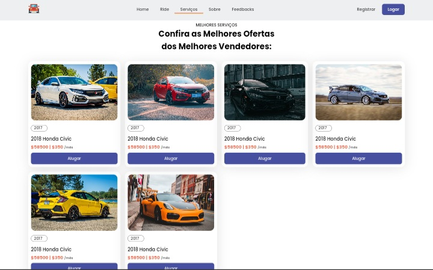

# Site de Aluguel de Carros

Esse é um site fictício e sem fins lucrativos.

***

## 🚀 Sobre o projeto
O projeto é um site de aluguel e carros, que possui seções como Home, Sobre, Newsletter, Feedbacks e um cabeçalho com links de navegação interna.

### Screenshots do projeto

Imagem 1

***

## 🚀 Ferramentas Utilizadas
- HTML e CSS: para estruturação e estilização do site
- JavaScript: para adicionar interatividade
- Git/GitHub: versionamento e hospedagem do projeto